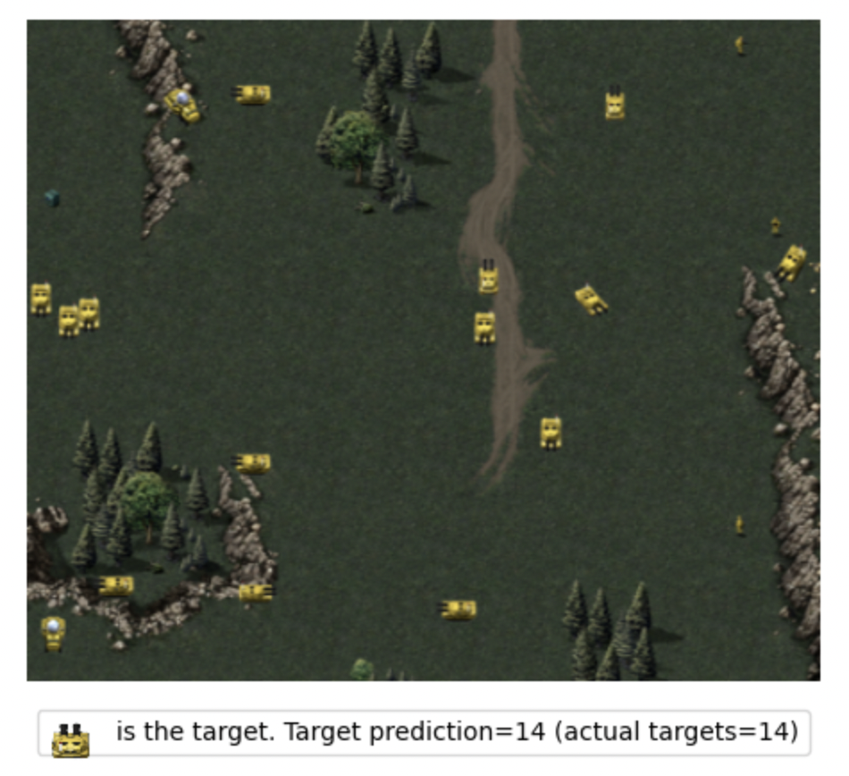

# cnn-unit-counting
Using a convolution neural network (CNN) for image counting. This repository samples red-alert map backgrounds, and for each sampled map, randomly pastes a target unit (to count) along with noise units. A CNN is, given sampled images of backgrounds and target units, is trained to count the number the target units for a given image. 



## Setup 
This code runs on a mac (osx-arm64 platform). To setup, run the following commands in the terminal within root of the cloned git repository. 


```
CONDA_SUBDIR=osx-arm64 conda create -n cnn_counter python=3.10.13 numpy==1.26.4

source activate base
conda activate cnn_counter 
conda install -c apple tensorflow-deps  
pip install tensorflow-macos
conda install notebook -y 

pip install pandas --upgrade
pip install matplotlib --upgrade
pip install scikit-learn --upgrade
pip install scipy --upgrade
pip install plotly --upgrade

pip install -r requirements.txt
```


## Running code
Within the cnn_counter conda environment, run the following commands in the terminal for an end-to-end execution of the data generation, training and analysis processes. 

### generate

```
python main.py --step generate --generate_reference demo
```
### train

```
python main.py --step train --train_reference demo
```

### analysis 
```
jupyter notebook
```
and run the analysis.ipynb notebook with specified generation_data and model keys (as specified during the generate and train steps).
